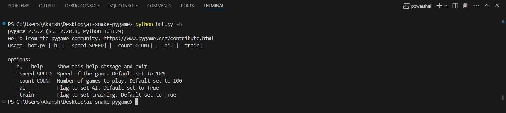
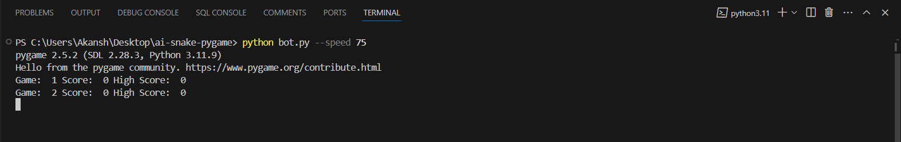
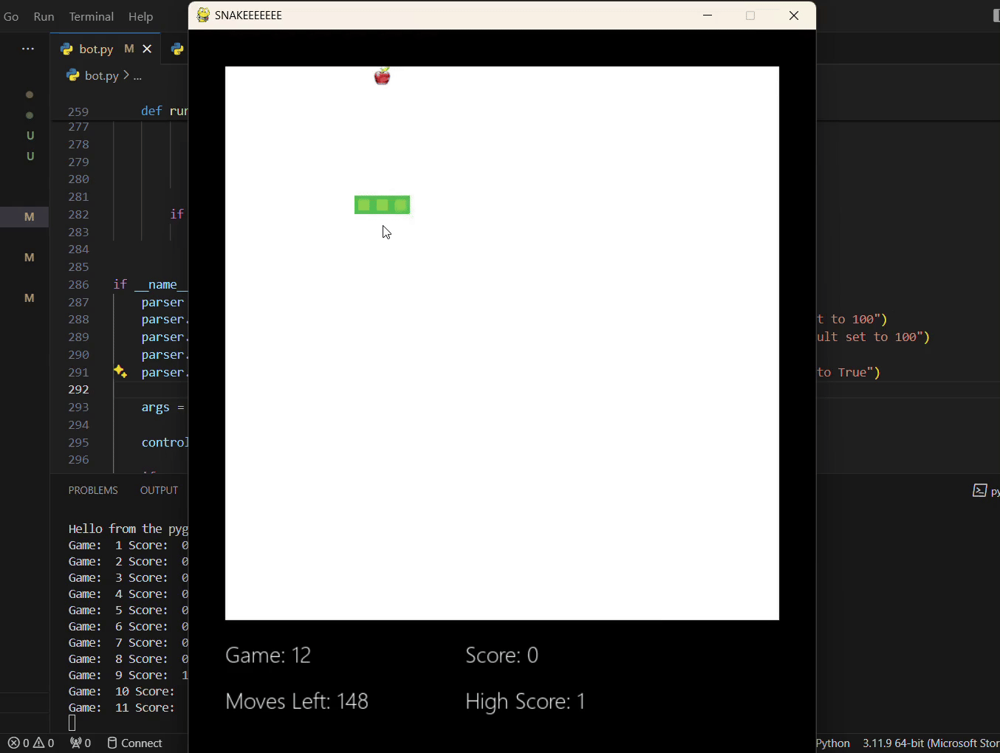
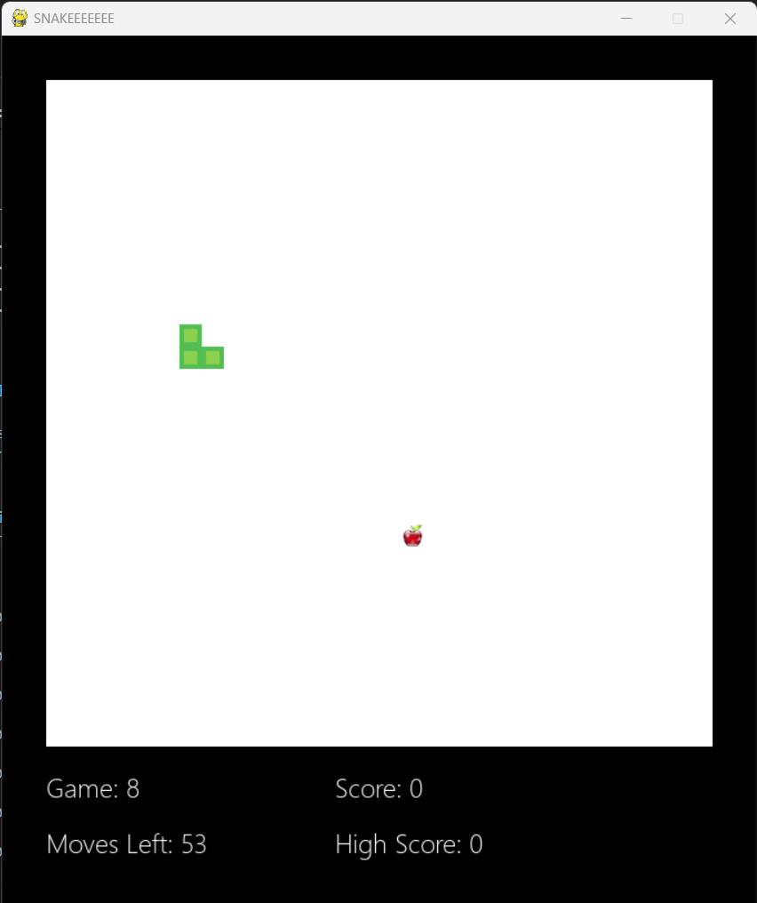
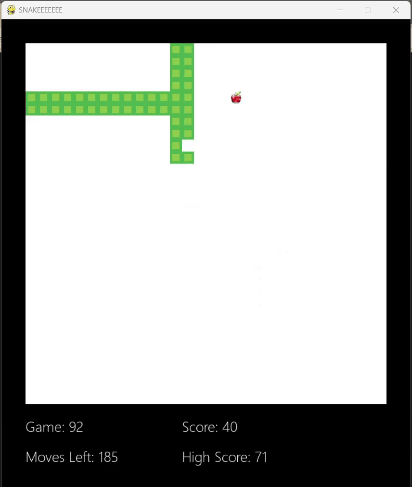

<h3 align="center">AISnake Game</h3>

---

<p align="center"> An AI-powered Snake game that offers both an automated mode for AI enthusiasts and a classic manual mode for traditional gameplay.
    <br> 
</p>

## 📝 Table of Contents

- [About](#about)
- [Getting Started](#getting_started)
- [Usage](#usage)
- [Built Using](#built_using)

## 🧐 About <a name = "about"></a>

This AI-powered Snake game offers a versatile gaming experience that caters to both classic gamers and AI enthusiasts. For classic players, game supports command line arguments to adjust the speed of the game as well as the number of games the user is wishing to play.
The AI mode plays the game itself of which the user can adjust the speed as well as the number of games he wants to train the AI for.
Also we can see te best trained AI so far.

## 🏁 Getting Started <a name = "getting_started"></a>

These instructions will get you a copy of the project up and running on your local machine for development and testing purposes. See [deployment](#deployment) for notes on how to deploy the project on a live system.

### Prerequisites

Open your terminal or command prompt in the working directory and run 

```
pip install -r requirements.txt
```

### Installing

Firstly clone the repository to your local machine by running the following command in git bash

```
git clone https://github.com/AkanshKh/ai-snake-pygame.git
```

- You can give many arguments to the script.



1) To run the classic manual mode run 

```
python bot.py --speed [whatever you like (lower is faster)] --count [number of games you want to play]
```




2) To train the AI for x number of games run 

```
python bot.py --count x --ai --train
```

3) To run the best saved model run

```
python bot.py --count x --ai
```

## 🎈 Results <a name="usage"></a>

- User playing



- Untrained AI




- Trained AI


## ⛏️ Built Using <a name = "built_using"></a>

- [PyGame](https://www.pygame.org/news) - Rendering Gaming Screen
- [PyTorch](https://pytorch.org/) - ML Framework

